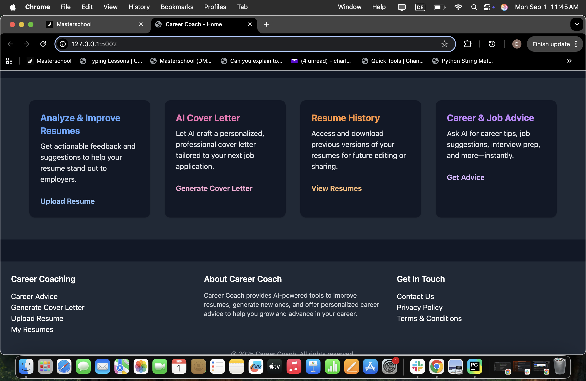
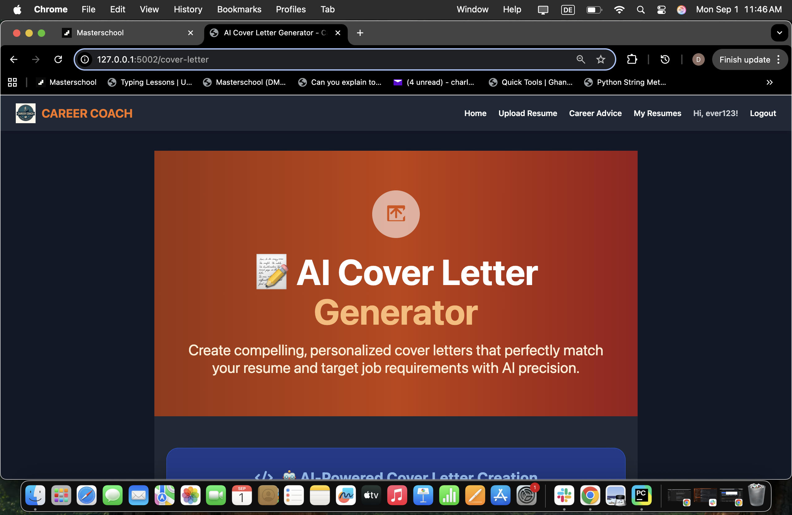
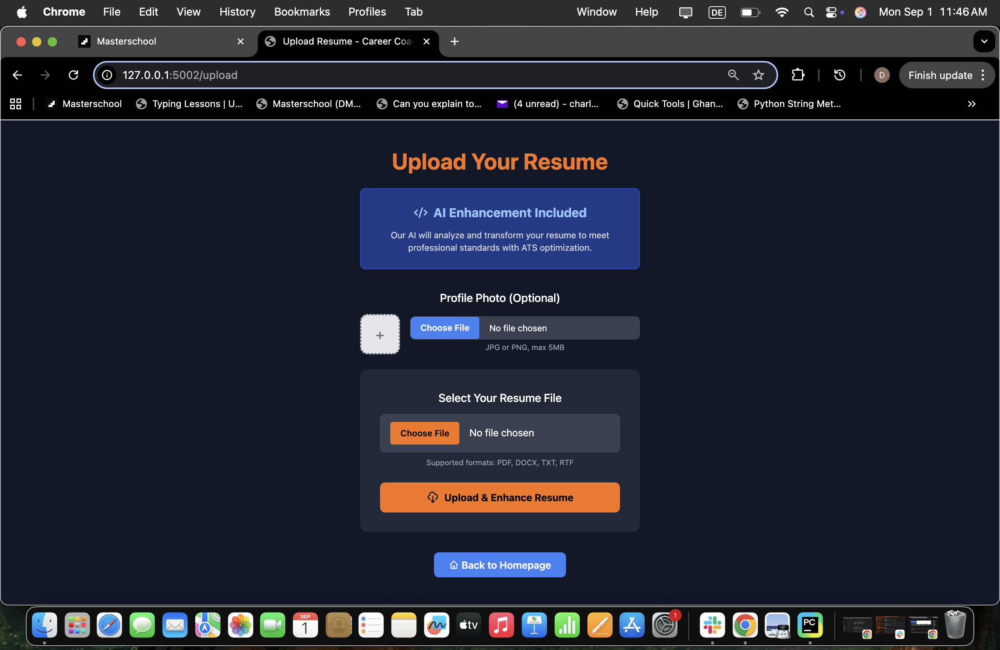
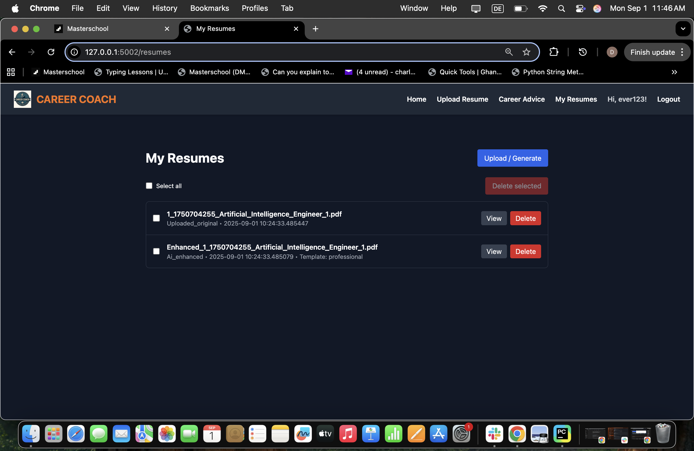
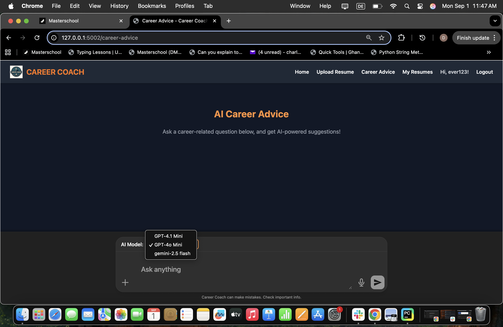

# Career Coach Web App

**AI-powered Career Coach Web Application for resume feedback, cover letter generation, and career advice.**

---

## Table of Contents

- [Description](#description)
- [Screenshots](#screenshots)
- [Features](#features)
- [Installation](#installation)
- [Usage](#usage)
- [Project Structure](#project-structure)
- [Technologies](#technologies)
- [Contributing](#contributing)
- [License](#license)
- [Contact](#contact)

---

## Description

Career Coach Web App
AI-powered Career Coach Web Application for resume feedback, cover letter generation, and career advice.


Table of Contents
Description
Screenshots
Features
Installation
Usage
Project Structure
Technologies
Contributing
License
Contact
Description
Career Coach is a modern web application that leverages AI to help users improve their resumes, generate professional cover letters, and receive personalized career advice. It supports resume uploads, AI-driven enhancements, and provides a user-friendly interface for managing career documents.

Screenshots
🔹 Homepage
Homepage


## Screenshots

### 🔹 Homepage


### 🔹 Feature Highlights


### 🔹 AI Cover Letter Generator


### 🔹 Resume Upload Page


### 🔹 Resume Dashboard


### 🔹 AI Career Advice



---

## Features

- ✅ **AI-powered resume analysis and enhancement**
- ✅ **Professional cover letter generation with AI**
- ✅ **Multiple resume templates with photo integration**
- ✅ **Live typing animation for AI-generated content**
- ✅ **User authentication and dashboard**
- ✅ **Resume upload and management**
- ✅ **Career advice and interview tips**
=======
🔹 Feature Highlights
Features

🔹 AI Cover Letter Generator
Cover Letter


🔹 Resume Upload Page
Upload Resume

🔹 Resume Dashboard
My Resumes

1. **Clone the repository**  
```bash

🔹 AI Career Advice
Career Advice

Features
✅ AI-powered resume analysis and enhancement
✅ Professional cover letter generation with AI
✅ Multiple resume templates with photo integration
✅ Live typing animation for AI-generated content
✅ User authentication and dashboard
✅ Resume upload and management
✅ Career advice and interview tips


Installation
Clone the repository

git clone https://github.com/Dennis2y/Career-Coach-Web-App.git
cd Career-Coach-Web-App

Create and activate a virtual environment

python -m venv venv
source venv/bin/activate   


Install dependencies

pip install -r requirements.txt


Set up environment variables
Create a .env file in the root directory and add:

OPENAI_API_KEY=your-api-key-here
GOOGLE_API_KEY=
FLASK_ENV=development
SECRET_KEY=your-secret-key


Run database migrations

flask db upgrade


Start the Flask development server

flask run --port=5002


Open your browser
Visit http://localhost:5002

Usage

Register or log in to your account

Upload your resume for AI enhancement

Generate cover letters tailored to job descriptions

Choose from multiple resume templates

Access career advice and interview tips

Project Structure
Career-Coach-Web-App
├── migrations/
├── static/
│   ├── assets/
│   │   ├── home.png
│   │   ├── features.png
│   │   ├── cover_letter.png
│   │   ├── upload_resume.png
│   │   ├── my_resumes.png
│   │   └── career_advice.png
│   └── images/
│       ├── robot.png
│       └── logo.png
├── templates/
│   ├── 404.html
│   ├── 429.html
│   ├── admin_dashboard.html
│   ├── base.html
│   ├── career_advice.html
│   ├── cover_letter.html
│   ├── dashboard.html
│   ├── enhanced_resume_view.html
│   ├── home.html
│   ├── interview_tips.html
│   ├── login.html
│   ├── register.html
│   ├── resume_view.html
│   ├── resumes_list.html
│   └── upload.html
├── uploads/  
├── .env
├── render.yaml
├── app.py
├── models.py
├── requirements.txt
└── README.md

Technologies

Python 3.10+

Flask

Flask-Login

SQLAlchemy

OpenAI API
gemini 2.5 flash
Tailwind CSS

Jinja2 Templates

WeasyPrint (for PDF resume generation)

Contributing

Contributions are welcome!
Please fork the repository, make your changes, and submit a pull request.

License

This project is licensed under the MIT License.

Contact

Dennis Charles
📧 Email: [charles.dennis71@yahoo.com]
🌐 GitHub: https://github.com/Dennis2y


---

### ✅ Next Step

Make sure the images are renamed as follows and located in `static/assets/`:

| Filename | Matches Section |
|----------|------------------|
| `home.png` | Homepage |
| `features.png` | Feature Highlights |
| `cover_letter.png` | AI Cover Letter Generator |
| `upload_resume.png` | Resume Upload Page |
| `my_resumes.png` | Resume Dashboard |
| `career_advice.png` | AI Career Advice |


